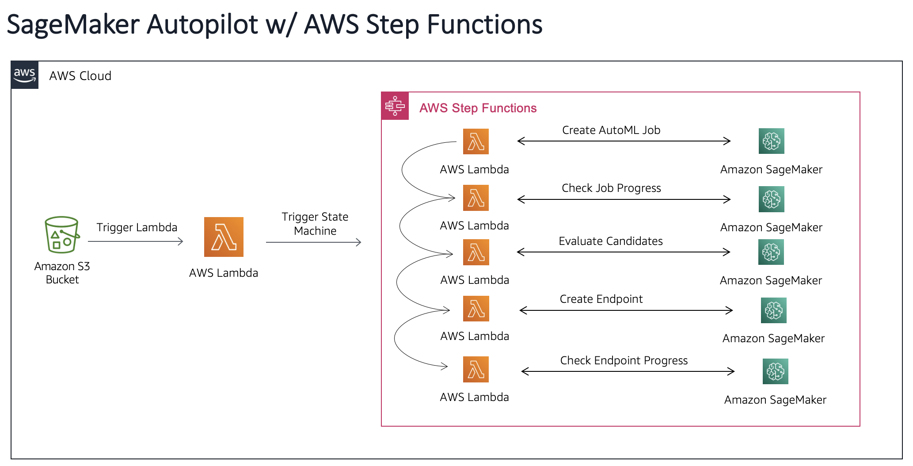
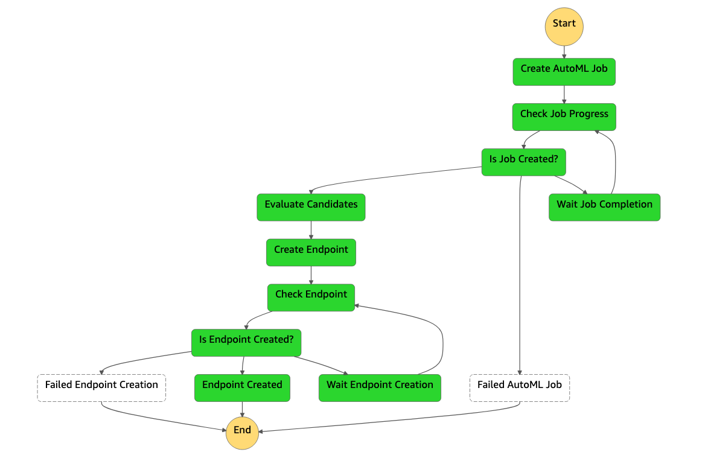

# Amazon SageMaker Autopilot with AWS Step Functions

### Why am I here?
In this section you are going to explore the creation of an Amazon SageMaker Autopilot Pipeline using and AWS Step Functions workflow.

### Why do I need?

* **Web Browser** I imagine you already have one if you are reading this.
* **Labeled Data** You will need to provide labeled data (**.csv**) in order to create a model to fullfill your business need.   
* **AWS Account** If you don't already have an account or you have not been handed one as part of a workshop, please visit the following [link](https://aws.amazon.com/es/free)! 

### What am I going to build?

As mentioned before, the objective is for you to create an Amazon SageMaker Autopilot Pipeline making use of AWS Step Functions. To accelerate the process and get to the fun of testing, you are going to deploy all the infrastructure needed automatically with an AWS CloudFormation template already created. 

Here is a concept diagram of the infrastructure you are going to deploy with CloudFormation. 

- The template will create an S3 bucket(with a data/ folder), where you will drop your data into.
- Once the data is in the specified folder, it will trigger an AWS Lambda function.
- The function will start an AWS Step Functions workflow, passing the location of your data.
- The workflow will consist on different steps, where AWS Lambda functions will interact with Amazon Sagemaker to create the end-to-end Autopilot pipeline.

### Cool, but how do I deploy this infrastructure?

* **Step 1:** Deploy the AWS Infrastructure:
  * [Launch](https://eu-west-1.console.aws.amazon.com/cloudformation/home?region=eu-west-1#/stacks/create/review?templateURL=https://ml-demos-stepsmp.s3.eu-west-1.amazonaws.com/cft-template.yaml&stackName=SageMaker-Step-Pipelines) the following **AWS CloudFormation Template** in your account (The link will automatically open the AWS CloudFormation console).
  * Select your Stack Name, insert a **UNIQUE** S3 bucket name(unique and lowercase please), check the AWS CloudFormation acknowledgements and click Create stack.
  * Wait until the stack goes into the **CREATE_COMPLETE status**, then go to the **Outputs tab**.
  * You will see an output named **InputBucket** which you will use to upload your data to.
* **Step 2:** You are now ready to upload your **.csv file** to the **data/ folder**, which will automatically start an AWS Step Functions Workflow execution. Your workflow should look like the following image.

